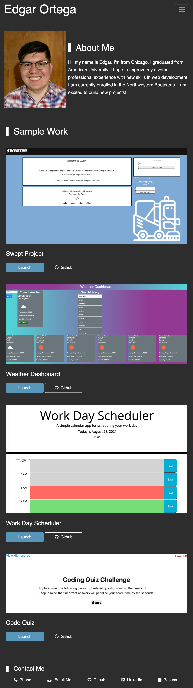
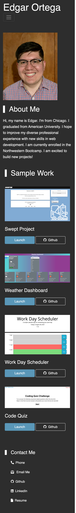

# Portfolio
Link: https://edgaro93.github.io/Portfolio/

## Description
I updated my porfotlio with recent work I have done. I wanted to include some new design features I have learned such as Bootstrap framework. With a better understanding of mobile first design, I had a better time incorporating Reponsive Design. Personally, I am proud of the work I have been able to showcase especially the Swept project I collaboarated with. I decided to not have any JavaScript functions so that might be something I am thinking of adding. Lastly, I got more experience using GitHub as I added Licenses to past projects and mirrored my old porfolio repository.

## Screenshot
### Desktop view

### Mobile View

## Contact Info
You can contact me at edort93@gmail.com

## License
This project is licensed under the terms of the MIT license.

## Acknowlegments
~~~
I would like to thank my tutor and TAs as well online resources such as W3 schools, MDN Web Docs, and Stack Overflow.
~~~
