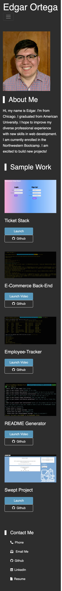

# Portfolio

Link: https://edgaro93.github.io/EdgarPortfolio/

## Description
This portfolio includes some new design features I have learned such as Bootstrap framework. With a better understanding of mobile first design, I had a better time incorporating Reponsive Design. Personally, I am proud of the work I have been able to showcase especially the Swept project I collaborated with. I decided to not have any JavaScript functions so that might be something I am thinking of adding. Lastly, I got more experience using GitHub as I added Licenses to past projects and mirrored my old portfolio repository.

This is my latest updated portfolio. I have added some of my recent back-end projects and my Ticket Stack full stack project I collaborated on. These projects showcase my work learning new technologies such as Node.js and MySQL. Since some of these projects were not deployed, I have shared links to videos displaying how the applications work. 

## Screenshot
### Desktop view

### Mobile View

## Contact Info
You can contact me at edort93@gmail.com

## License
This project is licensed under the terms of the MIT license.

## Acknowledgments
~~~
I would like to thank my tutor and TAs as well online resources such as W3 schools, MDN Web Docs, and Stack Overflow.
~~~
